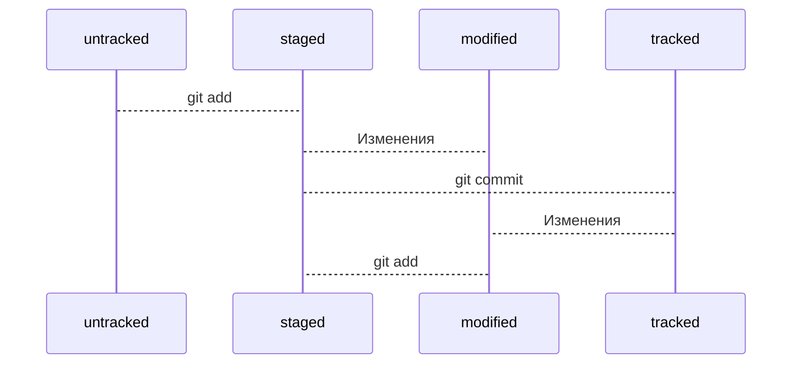

# git_helper
## yandex practicum task #1

----

### Шпаргалка с основными Git командами

* Инициализировать репозиторий можно с помощью команды `git init`.
* Проверить статус, или состояние, репозитория поможет команда `git status`.
* Если вы ошиблись и случайно инициализировали не ту папку, можно «разгитить» её — удалить скрытую подпапку `.git`.
* Команда `git add` позволяет подготовить файл к сохранению.
* Команда `git add --all` подготовит к сохранению сразу все файлы.
* С помощью `git add .` можно добавить в репозиторий текущую папку со всеми файлами.
* Коммит можно сделать с помощью команды `git commit`.
* Ключ `-m` позволяет присвоить коммиту сообщение.
* Команда `git log` позволяет просмотреть историю коммитов.

[Остальные команды и их описания](https://git-scm.com/book/ru/v2/%D0%9F%D1%80%D0%B8%D0%BB%D0%BE%D0%B6%D0%B5%D0%BD%D0%B8%D0%B5-C:-%D0%9A%D0%BE%D0%BC%D0%B0%D0%BD%D0%B4%D1%8B-Git-%D0%9E%D1%81%D0%BD%D0%BE%D0%B2%D0%BD%D1%8B%D0%B5-%D0%BA%D0%BE%D0%BC%D0%B0%D0%BD%D0%B4%D1%8B "Привет о_о")

### Полезная информация

#### Хэш

* Git преобразует информацию о коммитах с помощью алгоритма SHA-1 и для каждого из них рассчитывает уникальный идентификатор — хеш.
* Хеш — основной идентификатор коммита и позволяет узнать его автора, дату и содержимое закоммиченных файлов.
* Все хеши, а также таблицу соответствий `хеш → информация о коммите` Git хранит в папке `.git`.

#### Лог

После вызова `git log` появляется список коммитов. В описании каждого коммита содержатся:
* строка из цифр и латинских букв после слова commit — это хеш коммита;
* Author — имя автора и его электронная почта;
* Date — дата и время создания коммита;
* в конце находится сообщение коммита.

Получить сокращённый лог можно с помощью команды `git log с флагом --oneline` (англ. «одной строкой»). В терминале появятся только первые несколько символов хеша каждого коммита и их комментарии.

Сокращённый хеш (то есть первые несколько символов полного) можно использовать точно так же, как и полный. Для этого команда `git log --oneline` автоматически подбирает такую длину сокращённых хешей, чтобы они были уникальными в пределах репозитория и Git всегда мог понять, о каком коммите идёт речь.

#### HEAD

* В числе прочих файлов в папке `.git` есть служебный файл `HEAD`. Он указывает на самый свежий коммит.
* Вместо хеша последнего коммита можно написать слово `HEAD` — Git вас поймёт.

#### Статусы

* Статусом `untracked` помечается файл, о существовании которого Git знает, но не следит за изменениями в нём. Этот статус — противоположность `tracked`, в который попадают все файлы, отслеживаемые Git.
* Файл переходит в статус `staged` после выполнения `git add`.
* Статус `modified` означает, что файл был изменён.
* Большинство файлов в проектах «шагает» по следующему циклу:

